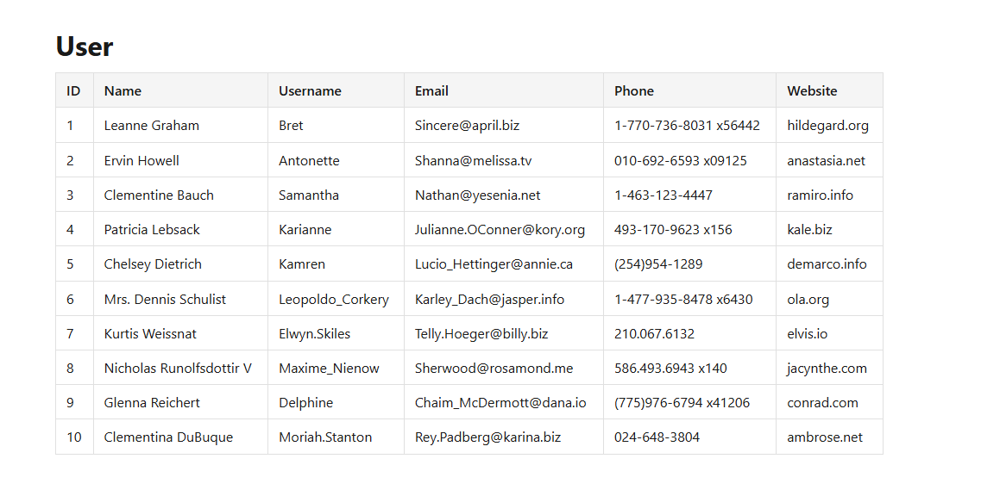

# Vue 3 + Vite

This template should help get you started developing with Vue 3 and JavaScript in Vite. The template uses Vue 3 `<script setup>` SFCs, check out the [script setup docs](https://v3.vuejs.org/api/sfc-script-setup.html#sfc-script-setup) to learn more.

Learn more about the recommended Project Setup and IDE Support in the [Vue Docs](https://vuejs.org/guide/scaling-up/tooling.html#project-setup).

Serves the production build locally to preview it.

## โจทย์: Vue 3 Employee Management

**Part 1 — Fetch Users**

- ดึงข้อมูล user จาก API `https://jsonplaceholder.typicode.com/users`
- แสดงผลเป็นตาราง (ID, Name, Username, Email, Phone, Website)

**Part 2 — Employee Form**

- สร้างฟอร์มรับข้อมูล Employee: Employee Id, Employee Name, Salary
- เมื่อกด Add ให้เพิ่มข้อมูลเข้า state (list) โดยไม่ยิง API (เก็บใน local state เท่านั้น)
- แสดงรายการ Employee ทั้งหมดเป็นตาราง

**Part 3 — Summary Actions**

- ปุ่ม "แสดงคนทั้งหมด" → แสดงจำนวนแถว (Row) ทั้งหมดของ Employee
- ปุ่ม "Total Salary" → แสดงผลรวมเงินเดือนของ Employee ทั้งหมด
- ปุ่ม "Max Salary" → แสดงชื่อและเงินเดือนของ Employee ที่มีเงินเดือนสูงสุด
- แต่ละปุ่มกดแล้ว toggle แสดง/ซ่อนผลลัพธ์ได้

## Result

